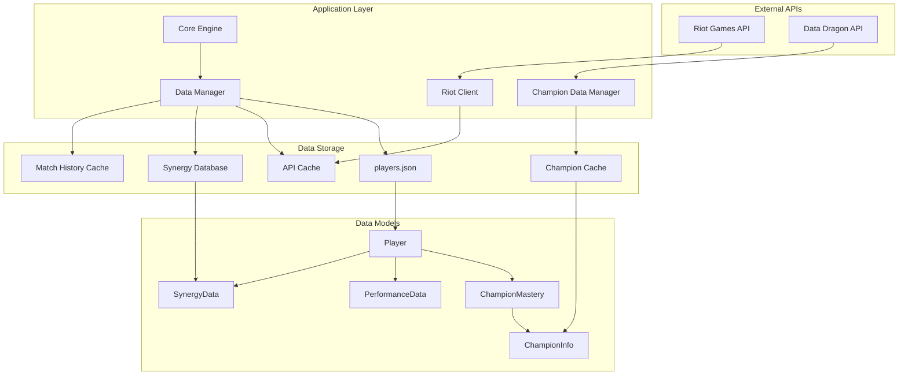
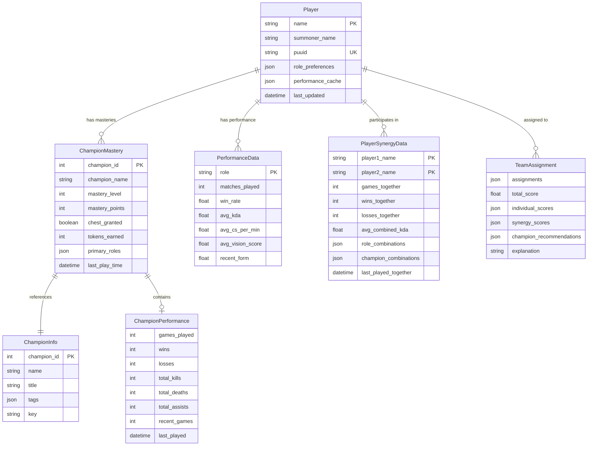

# League of Legends Team Optimizer - Data Architecture

This document describes the complete data storage architecture, data models, and relationships within the League of Legends Team Optimizer application.

## Overview

The application uses a hybrid storage approach combining JSON files for persistent data and in-memory caching for performance optimization. Data is organized into several key categories: player data, champion information, performance metrics, synergy data, and API caches.

## Data Storage Architecture

```
lol-team-optimizer/
├── data/                           # Persistent application data
│   ├── players.json               # Main player database
│   ├── matches.json               # Centralized match database
│   ├── match_index.json           # Match index by player PUUID
│   ├── migration_log.json         # Migration history
│   ├── backups/                   # Data backups
│   └── logs/                      # Application logs
├── cache/                         # Temporary cached data
│   ├── champion_data/             # Champion information cache
│   ├── api_cache/                 # API response cache
│   ├── synergy_data.json          # Player synergy database
│   ├── mastery_*.json             # Champion mastery cache (per player)
│   ├── matches_*.json             # Legacy match history cache (deprecated)
│   └── *.json                     # Individual API response cache files
└── config/                        # Configuration files
    └── .env                       # Environment variables (API keys)
```

## Core Data Models

### 1. Player Data Model

The `Player` class is the central data structure representing a League of Legends player.

```python
@dataclass
class Player:
    name: str                                           # Display name
    summoner_name: str                                  # Riot ID (gameName#tagLine)
    puuid: str                                          # Riot's unique player identifier
    role_preferences: Dict[str, int]                    # Role preferences (1-5 scale)
    performance_cache: Dict[str, Dict]                  # Cached performance data by role
    champion_masteries: Dict[int, ChampionMastery]      # Champion mastery data
    role_champion_pools: Dict[str, List[int]]           # Champions per role
    last_updated: Optional[datetime]                    # Last data refresh timestamp
```

**Storage Location**: `data/players.json`
**Format**: JSON array of player objects
**Relationships**: 
- Links to champion data via `champion_masteries`
- References API cache via `puuid`
- Connected to synergy data via player names

### 2. Champion Mastery Model

Represents a player's mastery and performance with a specific champion.

```python
@dataclass
class ChampionMastery:
    champion_id: int                                    # Riot champion ID
    champion_name: str                                  # Champion display name
    mastery_level: int                                  # Mastery level (0-7)
    mastery_points: int                                 # Total mastery points
    chest_granted: bool                                 # Season chest earned
    tokens_earned: int                                  # Mastery tokens
    primary_roles: List[str]                            # Roles this champion plays
    last_play_time: Optional[datetime]                  # Last played timestamp
    performance: Optional[ChampionPerformance]          # Match performance data
```

**Storage**: Embedded within Player objects
**Relationships**:
- Child of Player model
- References ChampionInfo via `champion_id`
- Contains ChampionPerformance data

### 3. Champion Information Model

Static champion data from Riot's Data Dragon API.

```python
@dataclass
class ChampionInfo:
    champion_id: int                                    # Unique champion identifier
    name: str                                           # Champion name
    title: str                                          # Champion title
    tags: List[str]                                     # Role classifications
    key: str                                            # Champion key (string ID)
```

**Storage Location**: `cache/champion_data/`
**Format**: JSON files with champion data
**Relationships**:
- Referenced by ChampionMastery via `champion_id`
- Used for role classification and champion pools

### 4. Match Data Models

Centralized storage for League of Legends matches with deduplication.

```python
@dataclass
class Match:
    match_id: str                                       # Unique match identifier
    game_creation: int                                  # Unix timestamp
    game_duration: int                                  # Duration in seconds
    game_end_timestamp: int                             # Unix timestamp
    game_mode: str                                      # Game mode (CLASSIC, etc.)
    queue_id: int                                       # Queue type (420=Ranked Solo, etc.)
    participants: List[MatchParticipant]                # All match participants
    winning_team: int                                   # Winning team ID (100 or 200)
    stored_at: Optional[datetime]                       # When match was stored
    last_updated: Optional[datetime]                    # Last update timestamp

@dataclass
class MatchParticipant:
    puuid: str                                          # Player's unique identifier
    summoner_name: str                                  # Player's display name
    champion_id: int                                    # Champion played
    team_id: int                                        # Team (100=Blue, 200=Red)
    role: str                                           # Role assignment
    individual_position: str                            # Accurate position
    kills: int                                          # Kills in match
    deaths: int                                         # Deaths in match
    assists: int                                        # Assists in match
    total_damage_dealt_to_champions: int                # Damage to champions
    total_minions_killed: int                           # CS (minions)
    neutral_minions_killed: int                         # Jungle monsters
    vision_score: int                                   # Vision score
    gold_earned: int                                    # Gold earned
    win: bool                                           # Whether player won
```

**Storage Location**: `data/matches.json` (centralized) + `data/match_index.json` (index)
**Format**: JSON array of match objects with PUUID-based indexing
**Relationships**:
- References Player objects via PUUID
- Enables cross-player match analysis
- Supports team synergy calculations

### 5. Performance Data Model

Aggregated performance metrics for a player in a specific role.

```python
@dataclass
class PerformanceData:
    role: str                                           # Role (top, jungle, middle, support, bottom)
    matches_played: int                                 # Total matches in role
    win_rate: float                                     # Win rate (0.0-1.0)
    avg_kda: float                                      # Average KDA ratio
    avg_cs_per_min: float                               # Average CS per minute
    avg_vision_score: float                             # Average vision score
    recent_form: float                                  # Performance trend (-1 to 1)
```

**Storage**: Embedded within Player.performance_cache
**Relationships**:
- Child of Player model
- Derived from centralized match data via MatchManager

### 5. Synergy Data Models

Player synergy tracking for team optimization.

```python
@dataclass
class PlayerSynergyData:
    player1_name: str                                   # First player name
    player2_name: str                                   # Second player name
    games_together: int                                 # Total games played together
    wins_together: int                                  # Games won together
    losses_together: int                                # Games lost together
    avg_combined_kda: float                             # Average combined KDA
    avg_game_duration: float                            # Average game length
    avg_vision_score_combined: float                    # Combined vision score
    recent_games_together: int                          # Recent games (30 days)
    last_played_together: Optional[datetime]            # Last game timestamp
    role_combinations: Dict[Tuple[str, str], Dict]      # Performance by role pairs
    champion_combinations: Dict[Tuple[int, int], Dict]  # Performance by champion pairs
```

**Storage Location**: `cache/synergy_data.json`
**Format**: JSON object with synergy pairs as keys
**Relationships**:
- References Player objects via names
- Contains role and champion combination data
- Can be derived from centralized match data

## Data Flow and Relationships



## Storage Patterns

### 1. Persistent Data Storage

**Primary Storage**: JSON files in the `data/` directory
- **players.json**: Main database containing all player information
- **migration_log.json**: History of data migrations
- **backups/**: Timestamped backups of all data

**Characteristics**:
- Human-readable JSON format
- Atomic writes using temporary files
- Automatic backup creation before modifications
- Schema validation on load/save

### 2. Cache Storage

**Cache Directory**: `cache/` directory with multiple cache types
- **Individual API Responses**: Hashed filenames for specific API calls
- **Player-Specific Caches**: `mastery_*.json` and `matches_*.json` files
- **Shared Caches**: `synergy_data.json` for team synergy data

**Cache Characteristics**:
- TTL (Time To Live) based expiration
- Automatic cleanup of expired entries
- Size-based cache eviction
- Hash-based cache keys for uniqueness

### 3. Configuration Storage

**Environment Variables**: `.env` file containing:
- Riot API keys
- Configuration overrides
- Debug settings

## Data Relationships Diagram



## Cache Management

### Cache Types and TTL

| Cache Type | TTL | Storage Pattern | Purpose |
|------------|-----|-----------------|---------|
| API Responses | 1 hour | Individual JSON files | Rate limit optimization |
| Champion Data | 24 hours | Shared cache directory | Static game data |
| Player Masteries | 1 hour | Per-player files | Champion mastery data |
| Match History | 1 hour | Per-player files | Recent match data |
| Synergy Data | Persistent | Single JSON file | Team synergy analysis |
| Performance Cache | 24 hours | Embedded in player data | Role performance metrics |

### Cache Key Generation

```python
# API Response Cache
cache_key = hashlib.md5(f"{endpoint}_{params}".encode()).hexdigest()

# Player-Specific Cache
mastery_key = f"mastery_{player.puuid}"
matches_key = f"matches_{player.puuid}"

# Synergy Cache
synergy_key = f"{sorted([player1, player2])[0]}|{sorted([player1, player2])[1]}"
```

## Data Validation and Integrity

### Validation Rules

1. **Player Data**:
   - Unique player names within the system
   - Valid Riot ID format (gameName#tagLine)
   - Role preferences between 1-5
   - Valid PUUID format when present

2. **Champion Data**:
   - Valid champion IDs from Riot's champion list
   - Mastery levels between 0-7
   - Non-negative mastery points and tokens

3. **Performance Data**:
   - Win rates between 0.0-1.0
   - Non-negative statistics (KDA, CS, vision score)
   - Recent form between -1.0 and 1.0

### Data Integrity Measures

- **Atomic Writes**: Use temporary files and atomic renames
- **Backup Creation**: Automatic backups before major operations
- **Schema Validation**: Validate data structure on load
- **Error Recovery**: Graceful handling of corrupted data
- **Migration Support**: Automatic data format migration

## Centralized Match Storage Benefits

### 1. Deduplication and Efficiency

- **No Duplicate Matches**: Each match stored only once regardless of how many team members played
- **Reduced API Calls**: Matches already stored don't need to be fetched again
- **Cross-Player Analysis**: Enable analysis of team performance and synergy
- **Storage Efficiency**: Significant reduction in storage space compared to per-player storage

### 2. Enhanced Analytics

- **Team Match History**: Find matches where multiple team members played together
- **Synergy Analysis**: Calculate real synergy data from actual match performance
- **Role Performance**: More accurate role-based performance metrics
- **Historical Trends**: Track team performance over time

### 3. Data Integrity

- **Consistent Match Data**: Single source of truth for match information
- **Automatic Indexing**: Fast lookup by player PUUID
- **Cleanup Capabilities**: Remove old matches to manage storage size
- **Rebuild Support**: Reconstruct indexes if needed

## Performance Optimizations

### 1. Caching Strategy

- **Multi-Level Caching**: In-memory → File cache → API
- **Intelligent TTL**: Different expiration times based on data volatility
- **Batch Operations**: Group related API calls to minimize requests
- **Lazy Loading**: Load data only when needed
- **Centralized Match Storage**: Eliminate duplicate match data across players

### 2. Data Access Patterns

- **Player Lookup**: O(1) access via in-memory cache
- **Champion Data**: Cached static data with periodic refresh
- **Synergy Calculations**: Pre-computed and cached results
- **Performance Metrics**: Aggregated and cached per role

### 3. Storage Optimization

- **Compressed JSON**: Minimize file sizes where possible
- **Selective Loading**: Load only required data subsets
- **Cache Cleanup**: Automatic removal of expired entries
- **Size Limits**: Configurable cache size limits with LRU eviction

## Migration and Versioning

### Data Migration System

The application includes a comprehensive migration system to handle data format changes:

- **Migration Detection**: Automatic detection of outdated data formats
- **Backup Creation**: Automatic backups before migration
- **Incremental Migration**: Support for step-by-step data updates
- **Rollback Support**: Ability to revert to previous data versions
- **Validation**: Post-migration data integrity checks

### Version Compatibility

- **Forward Compatibility**: New versions can read older data formats
- **Backward Compatibility**: Graceful degradation for missing fields
- **Schema Evolution**: Support for adding new fields without breaking changes
- **Migration Logging**: Detailed logs of all migration operations

## Security Considerations

### Data Protection

- **API Key Security**: Environment variable storage, never in code
- **Local Data**: No sensitive personal information stored
- **Cache Security**: Temporary data with automatic cleanup
- **Access Control**: File system permissions for data directories

### Privacy Compliance

- **Minimal Data**: Only store necessary game-related information
- **User Consent**: Players must provide their Riot IDs explicitly
- **Data Retention**: Configurable data retention policies
- **Anonymization**: No personally identifiable information beyond game names

## Monitoring and Diagnostics

### Data Health Monitoring

- **Cache Hit Rates**: Monitor cache effectiveness
- **Data Freshness**: Track last update timestamps
- **Error Rates**: Monitor data loading/saving failures
- **Storage Usage**: Track disk space usage for data and cache

### Diagnostic Tools

- **Migration CLI**: Command-line tools for data migration
- **Cache Inspector**: Tools to examine cache contents and health
- **Data Validator**: Verify data integrity and format compliance
- **Performance Profiler**: Analyze data access patterns and bottlenecks

This architecture provides a robust, scalable, and maintainable data storage solution that balances performance, reliability, and ease of use while supporting the complex relationships required for team optimization in League of Legends.