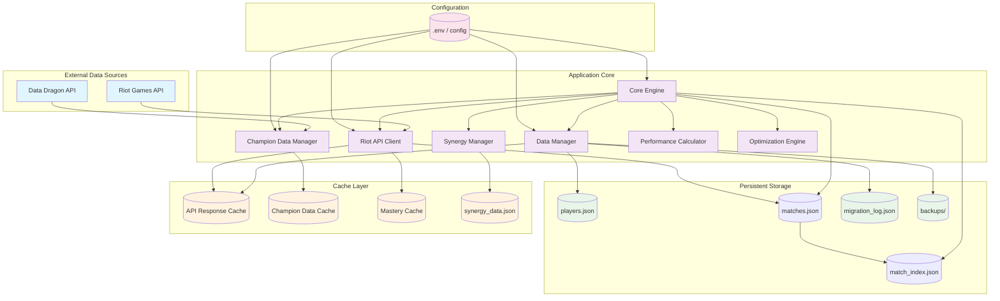
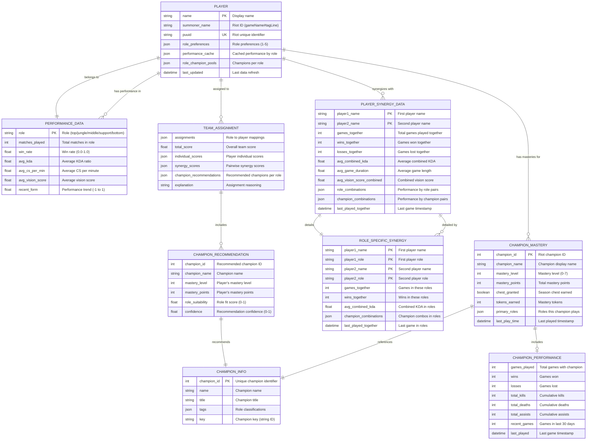
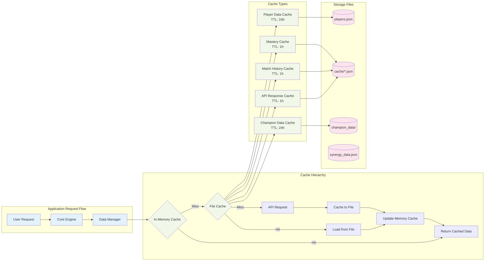
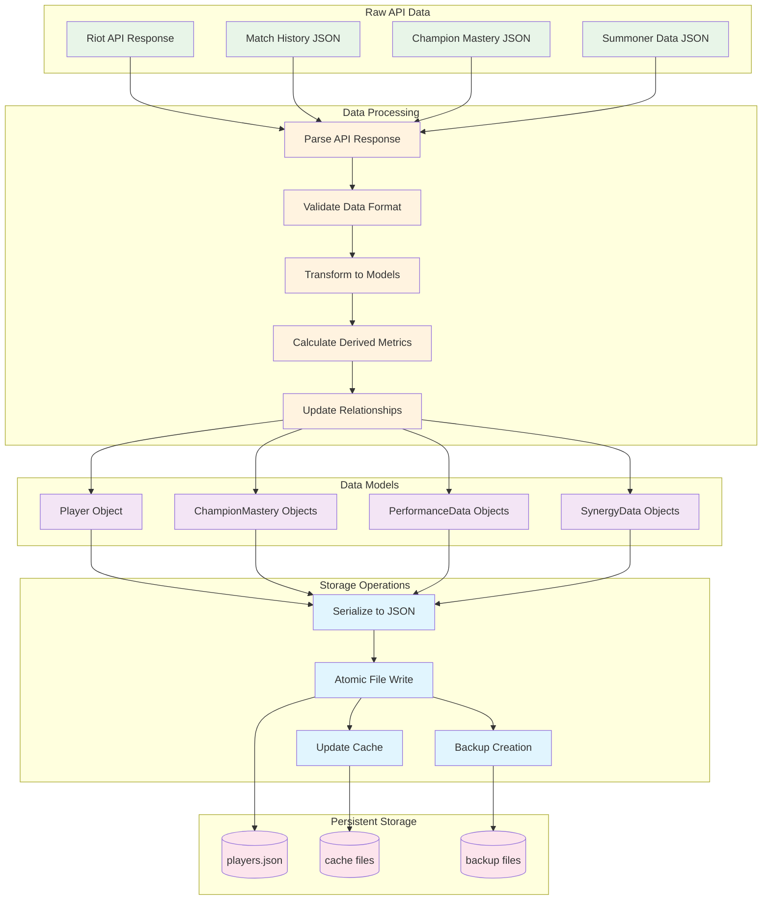
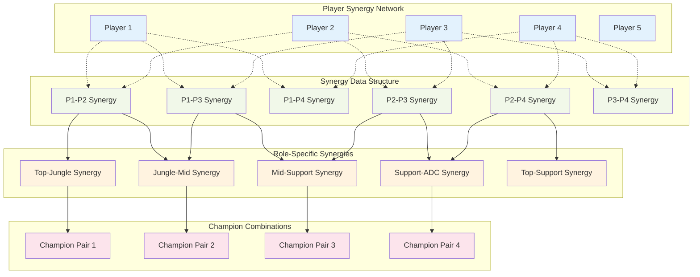
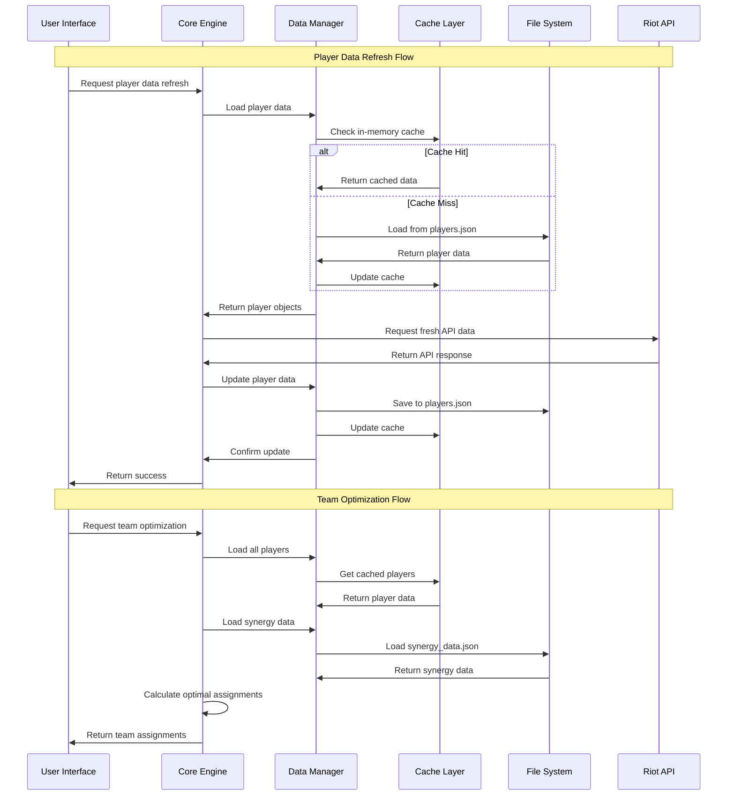

# Data Relationships Diagram

This document provides detailed visual representations of how data flows and relates within the League of Legends Team Optimizer.

## High-Level Data Flow Architecture



## Detailed Data Model Relationships



## Cache Architecture and Data Flow



## Data Transformation Pipeline



## Synergy Data Relationships



## Data Access Patterns



## File System Organization

```
lol-team-optimizer/
├── data/                                    # Persistent application data
│   ├── players.json                        # Main player database (JSON array)
│   │   └── [Player objects with embedded ChampionMastery and PerformanceData]
│   ├── migration_log.json                  # Migration history and status
│   ├── backups/                           # Timestamped data backups
│   │   ├── backup_20250128_120000/        # Backup directory
│   │   │   ├── players.json               # Backed up player data
│   │   │   ├── cache/                     # Backed up cache
│   │   │   └── backup_manifest.json       # Backup metadata
│   │   └── manual_backup_20250128/        # Manual backup
│   └── logs/                              # Application logs
│       └── app.log                        # Main application log
│
├── cache/                                  # Temporary cached data with TTL
│   ├── champion_data/                     # Static champion information
│   │   ├── champions.json                 # All champion data from Data Dragon
│   │   └── version.json                   # Data Dragon version info
│   ├── api_cache/                         # Legacy cache directory
│   ├── synergy_data.json                  # Player synergy database
│   ├── api_cache_old.json                 # Migrated legacy cache file
│   ├── mastery_[PUUID].json              # Per-player champion mastery cache
│   ├── matches_[PUUID].json              # Per-player match history cache
│   └── [hash].json                       # Individual API response caches
│
└── .env                                   # Environment configuration
    └── RIOT_API_KEY=...                   # Riot Games API key
```

This comprehensive data architecture documentation provides a complete understanding of how data flows through the League of Legends Team Optimizer, from external APIs through processing pipelines to persistent storage and caching layers.